# OpenWrt VLAN Security Homelab

## Overview

This project documents the design, implementation, and validation of a segmented networking and cybersecurity homelab using **OpenWrt** and a **NETGEAR GS308E managed switch**.

The lab was built to provide hands-on experience with:

- VLAN segmentation
- IEEE 802.1Q VLAN tagging
- Trunk and access ports
- DHCP
- Routing
- Firewall policies
- Inter-VLAN isolation
- Network troubleshooting
- Cybersecurity testing
- Forensic and malware-analysis network isolation

The environment separates management systems, servers, cybersecurity testing systems, IoT/test devices, and forensic/malware-analysis systems into dedicated VLANs.

---

## Lab Objectives

The primary objectives of this project were to:

- Configure OpenWrt as the lab router and firewall
- Configure a managed switch for VLAN segmentation
- Implement IEEE 802.1Q VLAN tagging
- Configure trunk and access ports
- Configure dedicated DHCP scopes for each VLAN
- Implement firewall zones and inter-VLAN isolation
- Provide Internet access only where required
- Create dedicated server and cybersecurity testing networks
- Build an isolated network for forensic and malware analysis
- Validate segmentation through connectivity testing
- Integrate physical and virtualized lab systems
- Document the implementation as a cybersecurity portfolio project

---

## Hardware and Software

| Component | Purpose |
|---|---|
| ASUS RT-N56U | OpenWrt router/firewall |
| OpenWrt 25.12.1 | Routing, DHCP, VLANs and firewall |
| NETGEAR GS308E | Managed Layer 2 switch |
| Rogers XB7 Gateway | Upstream Internet connection |
| Raspberry Pi 4 | Linux/testing system |
| Windows Systems | Management and lab endpoints |
| Forensic Laptop | Isolated forensic/malware-analysis system |
| VMware ESXi | Virtualized lab infrastructure |

---

# Network Architecture

The lab uses the following general topology:

```text
                    Internet
                       |
                Rogers XB7 Gateway
                  10.0.0.1/24
                       |
                       |
                OpenWrt Router
                 ASUS RT-N56U
                       |
                       |
                  802.1Q Trunk
                       |
                       |
                NETGEAR GS308E
                Managed Switch
                       |
       +---------------+---------------+
       |       |       |       |       |
    VLAN10  VLAN20  VLAN30  VLAN40  VLAN50
     Mgmt   Servers CyberLab IoT/Test Forensics
```

OpenWrt provides:

- Layer 3 routing
- DHCP services
- DNS forwarding
- Firewall enforcement
- Inter-VLAN traffic control
- Internet forwarding and NAT

The NETGEAR GS308E provides Layer 2 VLAN segmentation, VLAN tagging, and access-port assignment.

---

# VLAN Architecture

| VLAN | Name | Network | Gateway | Purpose |
|---|---|---|---|---|
| 10 | Management | 192.168.10.0/24 | 192.168.10.1 | Network administration |
| 20 | Servers | 192.168.20.0/24 | 192.168.20.1 | Server infrastructure |
| 30 | CyberLab | 192.168.30.0/24 | 192.168.30.1 | Cybersecurity testing |
| 40 | IoT/Test | 192.168.40.0/24 | 192.168.40.1 | IoT and test devices |
| 50 | Forensics | 192.168.50.0/24 | 192.168.50.1 | Forensics/malware analysis |

Each VLAN is assigned its own Layer 3 interface and DHCP scope on OpenWrt.

---

# Managed Switch Configuration

The NETGEAR GS308E was configured with a combination of **tagged trunk traffic** and **untagged access ports**.

## Port Assignment

| Switch Port | VLAN | Mode | Purpose |
|---|---|---|---|
| Port 1 | VLAN 1, 10, 20, 30, 40, 50 | Trunk/Hybrid | OpenWrt uplink |
| Port 2 | VLAN 10 | Access | Management |
| Port 3 | VLAN 20 | Access | Servers |
| Port 4 | VLAN 30 | Access | CyberLab |
| Port 5 | VLAN 30 | Access | CyberLab |
| Port 6 | VLAN 30 | Access | CyberLab |
| Port 7 | VLAN 40 | Access | IoT/Test |
| Port 8 | VLAN 50 | Access | Forensics |

Port 1 carries multiple VLANs between the managed switch and OpenWrt.

VLANs 10, 20, 30, 40, and 50 are carried as tagged traffic across the trunk.

Access ports present their assigned VLAN as untagged traffic to connected endpoints.

---

# VLAN 10 — Management

**Network:** `192.168.10.0/24`  
**Gateway:** `192.168.10.1`

VLAN 10 is the trusted management network.

It is used to administer infrastructure such as:

- OpenWrt
- NETGEAR managed switch
- Network infrastructure
- Administrative systems

The NETGEAR GS308E management interface was moved to VLAN 10.

The switch management address is:

```text
192.168.10.2
```

A VLAN 10 client successfully received an address through DHCP and was able to access the Internet and management infrastructure.

## VLAN 10 Evidence

### Connectivity Test

The management workstation successfully obtained VLAN 10 connectivity and could reach the appropriate network resources.

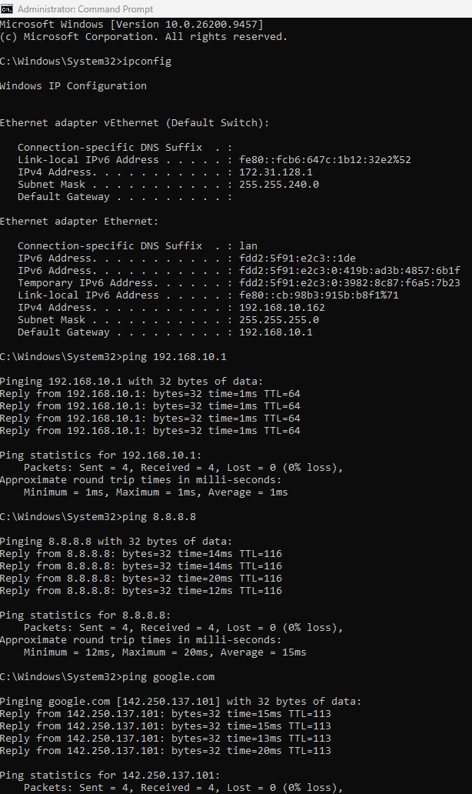

### NETGEAR Management VLAN

The GS308E management interface was assigned to VLAN 10 to separate switch administration from less-trusted networks.

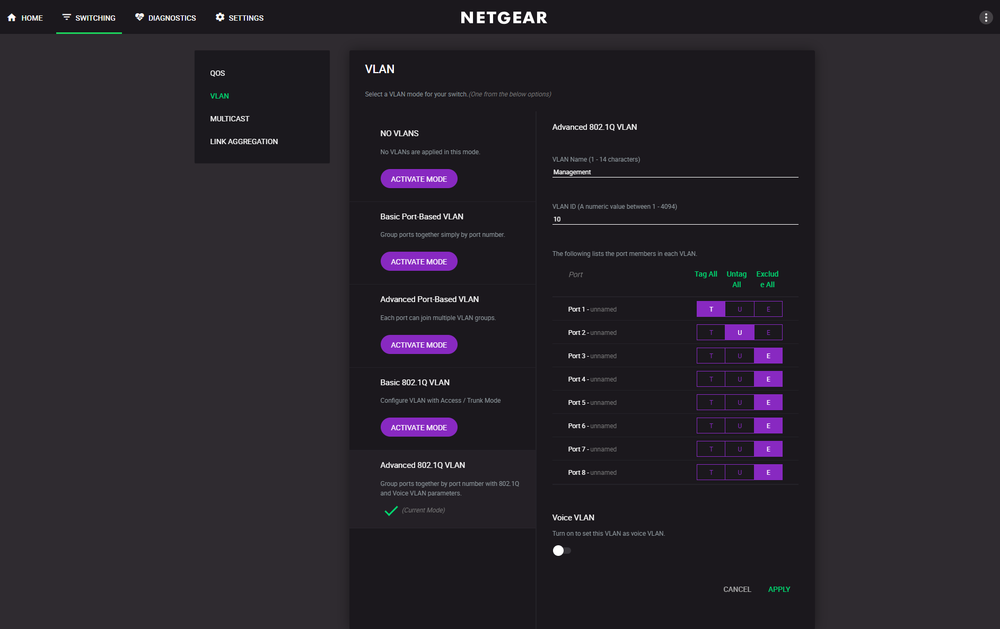

### OpenWrt Management Interface

OpenWrt provides the Layer 3 gateway and network services for the Management VLAN.

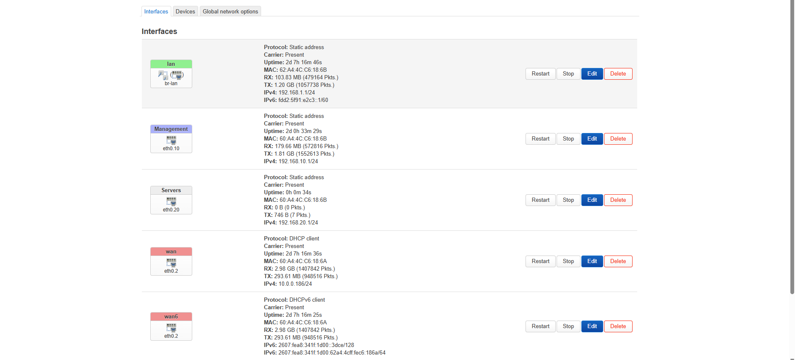

---

# VLAN 20 — Servers

**Network:** `192.168.20.0/24`  
**Gateway:** `192.168.20.1`

VLAN 20 provides a dedicated network for server infrastructure.

Separating servers from user and testing networks reduces unnecessary exposure and provides greater control over traffic entering and leaving the server network.

OpenWrt provides:

- VLAN 20 gateway
- DHCP
- DNS forwarding
- Firewall enforcement
- Internet forwarding

The GS308E assigns Port 3 as the VLAN 20 access port.

## VLAN 20 Evidence

### OpenWrt Server Firewall Zone

The Servers firewall zone controls traffic originating from the server network.

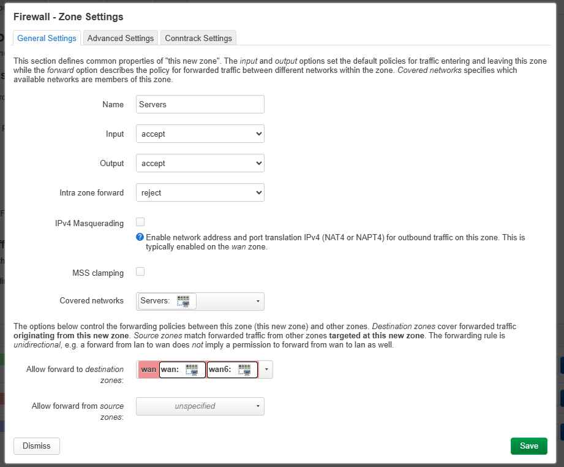

### GS308E Server VLAN

Port 1 carries VLAN 20 as tagged traffic to OpenWrt, while Port 3 operates as the VLAN 20 access port.

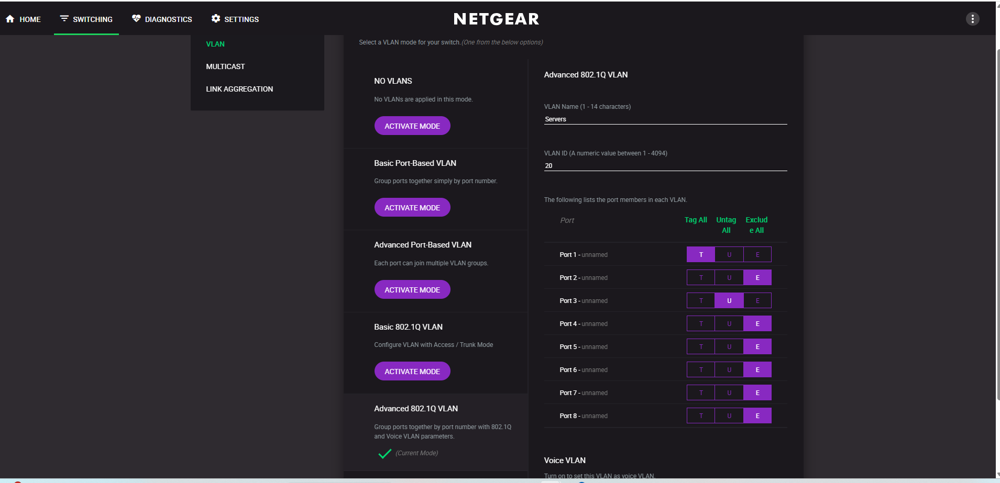

### Connectivity and Isolation Test

Testing verified VLAN 20 connectivity while also demonstrating the firewall's segmentation policy.

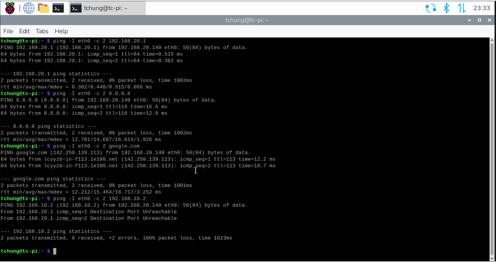

---

# VLAN 30 — CyberLab

**Network:** `192.168.30.0/24`  
**Gateway:** `192.168.30.1`

VLAN 30 is the dedicated cybersecurity testing network.

It can be used for:

- Kali Linux
- Raspberry Pi security projects
- Vulnerability testing
- Monitoring tools
- Cybersecurity virtual machines
- Security experimentation

Internet access is permitted while direct forwarding to protected VLAN devices is restricted.

During testing, a Raspberry Pi connected to VLAN 30 successfully received an address from the VLAN 30 DHCP server.

The system could reach:

```text
192.168.30.1
8.8.8.8
google.com
```

Attempts to reach devices located on protected VLANs were rejected by OpenWrt.

## VLAN 30 Evidence

### OpenWrt VLAN Configuration

VLAN 30 is tagged across the OpenWrt-to-GS308E trunk.

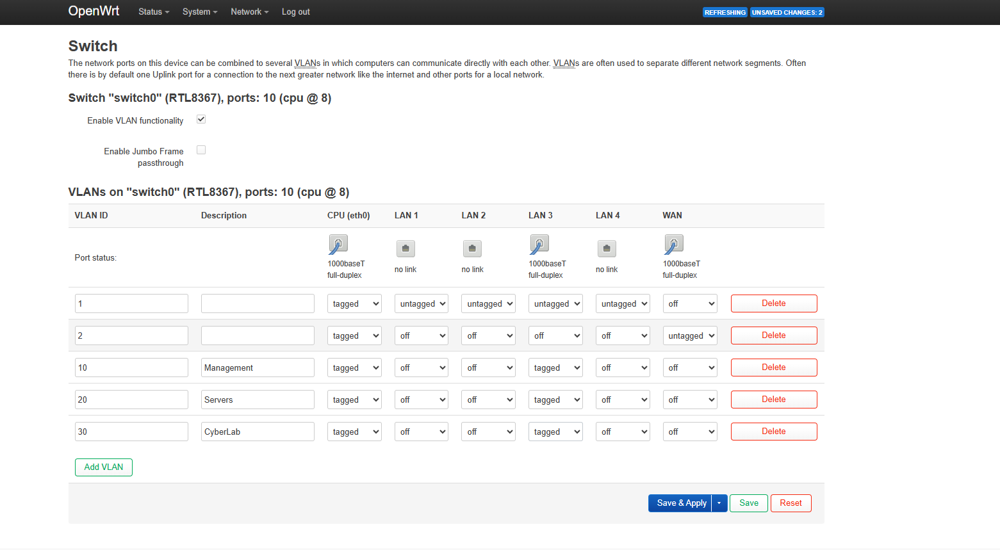

### CyberLab Firewall Zone

The CyberLab firewall zone permits required Internet access while restricting forwarding to protected internal networks.

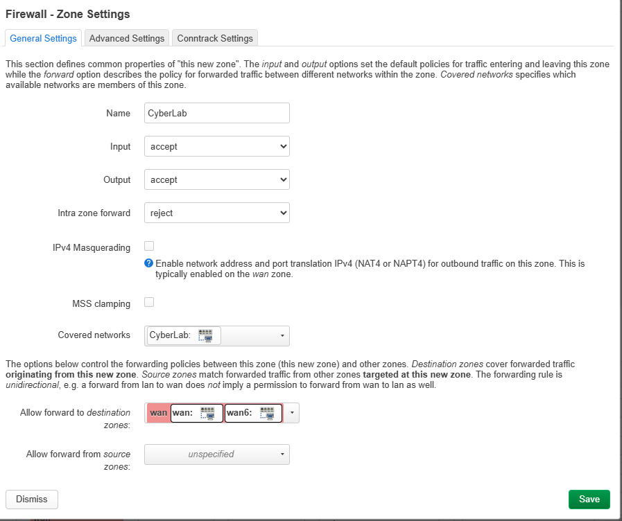

### Connectivity and Isolation Test

Testing confirmed that CyberLab devices could access required external resources while remaining segmented from protected internal devices.

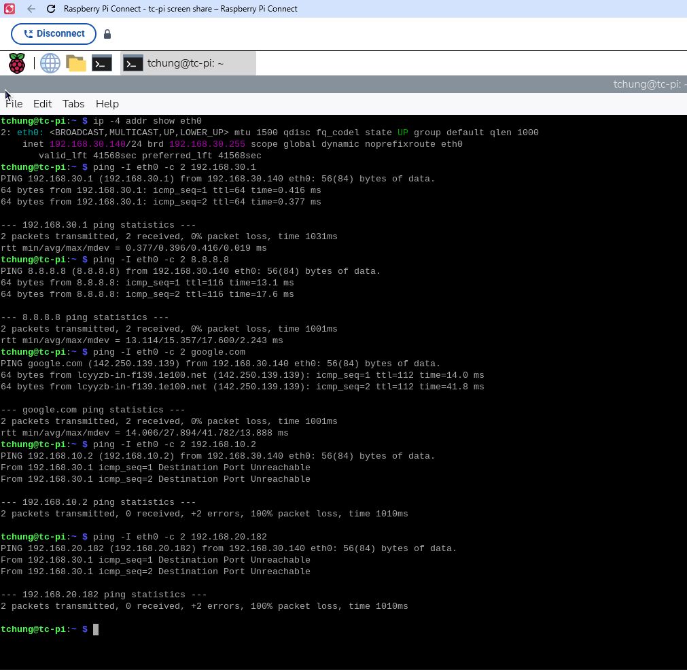

---

# VLAN 40 — IoT/Test

**Network:** `192.168.40.0/24`  
**Gateway:** `192.168.40.1`

VLAN 40 provides a separate network for IoT devices and test systems that should not have unrestricted access to trusted infrastructure.

The network provides:

- DHCP
- DNS
- Internet access
- Isolation from protected internal networks

The GS308E assigns Port 7 as an untagged VLAN 40 access port.

A Raspberry Pi was used to validate the network.

The Raspberry Pi successfully obtained an address from the VLAN 40 DHCP scope and could access:

```text
192.168.40.1
8.8.8.8
google.com
```

Attempts to reach protected devices on other VLANs were blocked by the OpenWrt firewall.

## VLAN 40 Evidence

### OpenWrt IoT/Test Firewall Zone

The OpenWrt firewall zone allows VLAN 40 devices to access the Internet while restricting forwarding to protected internal networks.

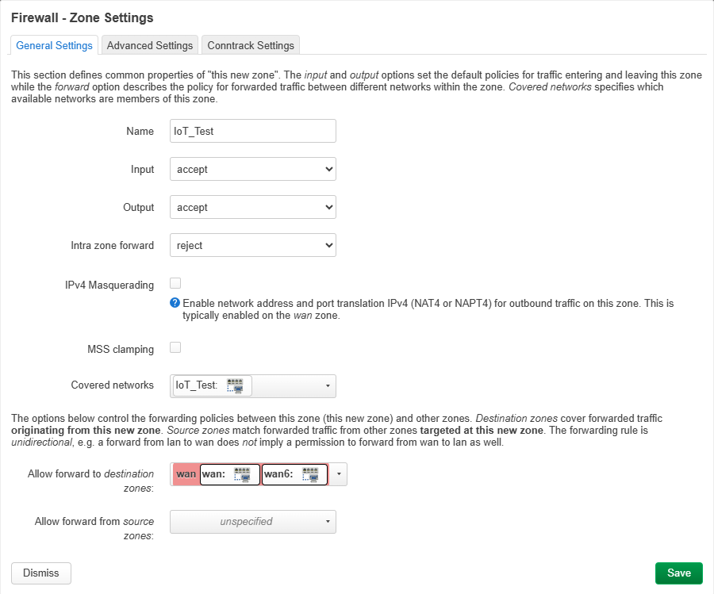

### GS308E VLAN Port Assignment

Port 1 carries VLAN 40 as tagged traffic across the trunk, while Port 7 provides untagged access to VLAN 40 devices.

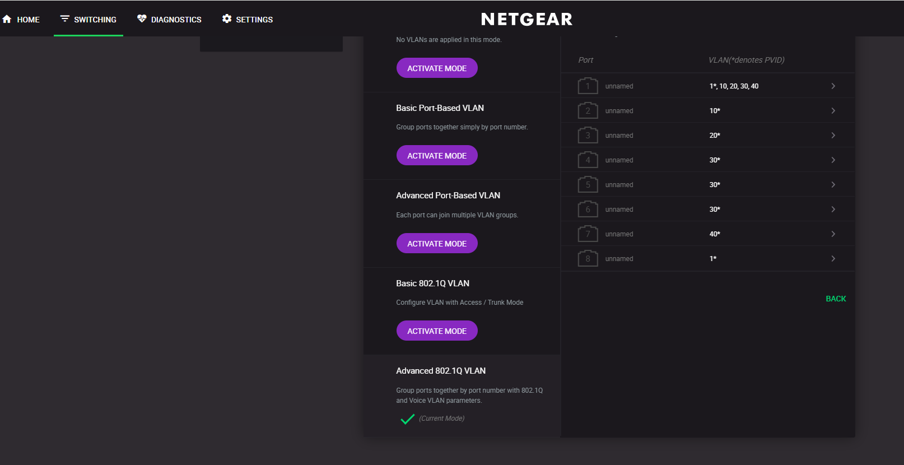

### Connectivity and Isolation Test

Connectivity testing confirmed Internet access while demonstrating isolation from protected internal devices.

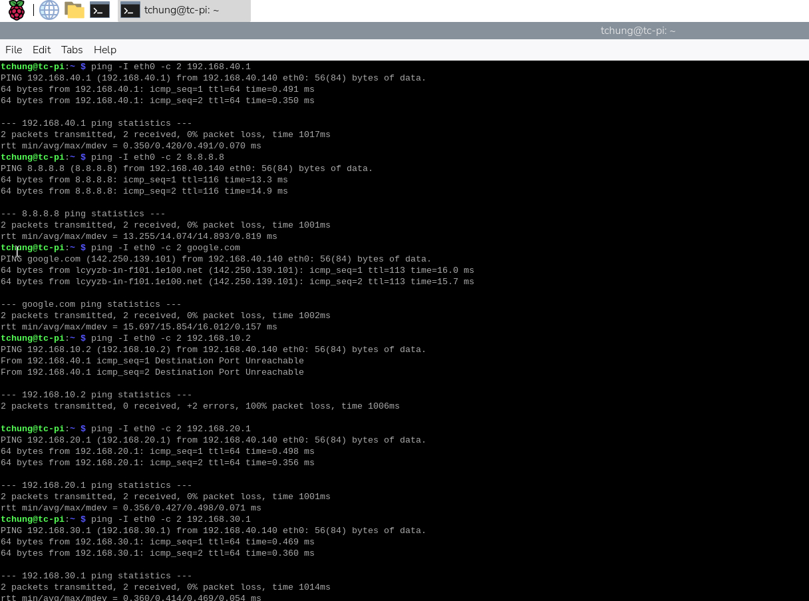

---

# VLAN 50 — Forensics / Malware Analysis

**Network:** `192.168.50.0/24`  
**Gateway:** `192.168.50.1`

VLAN 50 is the most restricted network in the lab.

It was designed for:

- Digital forensics
- Malware analysis
- Suspicious file analysis
- Isolated virtual machines
- Security experimentation

Unlike the other lab VLANs, VLAN 50 does **not** have forwarding permission to the WAN.

It also does not have forwarding permission to other internal VLANs.

```text
VLAN 50 -> Internet       BLOCKED
VLAN 50 -> Management     BLOCKED
VLAN 50 -> Servers        BLOCKED
VLAN 50 -> CyberLab       BLOCKED
VLAN 50 -> IoT/Test       BLOCKED
```

The GS308E assigns Port 8 as the VLAN 50 access port.

---

## VLAN 50 Validation

A Windows forensic/test laptop connected to Port 8 successfully received:

```text
IP Address:     192.168.50.182
Subnet Mask:    255.255.255.0
Gateway:        192.168.50.1
DNS:            192.168.50.1
DHCP Server:    192.168.50.1
```

The laptop successfully reached its local gateway:

```text
ping 192.168.50.1

SUCCESS
```

Internet forwarding was blocked:

```text
ping 8.8.8.8

Destination port unreachable
```

Cross-VLAN access was also tested against a Raspberry Pi located on VLAN 40:

```text
ping 192.168.40.140

Destination port unreachable
```

This demonstrated that OpenWrt was preventing the forensic network from forwarding traffic to devices on other VLANs.

## VLAN 50 Evidence

### DHCP and Network Configuration

The forensic workstation successfully received an address from the VLAN 50 DHCP scope, confirming correct VLAN tagging, access-port configuration, and DHCP operation.

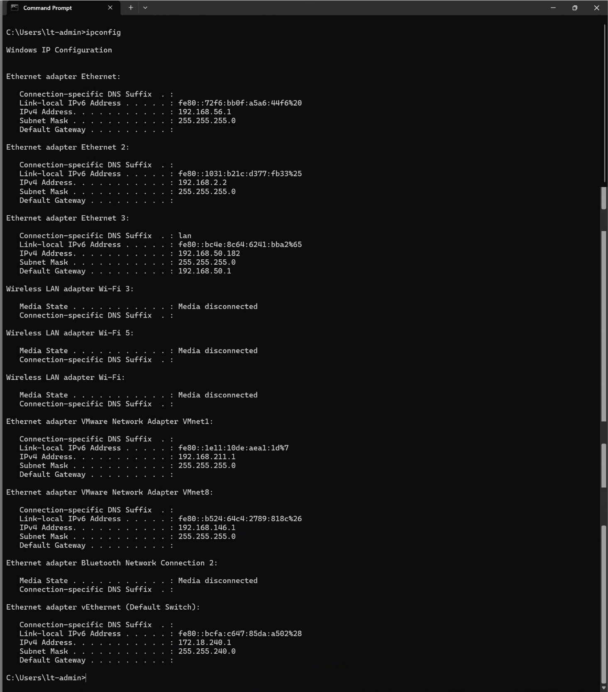

### Internet Isolation Test

The forensic workstation could communicate with its local gateway, while attempts to reach external Internet destinations were rejected by OpenWrt.

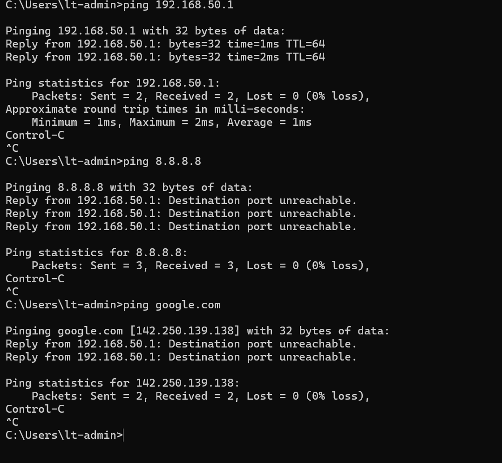

### Inter-VLAN Isolation Test

Testing against an actual device located on another VLAN confirmed that VLAN 50 could not forward traffic into other internal network segments.

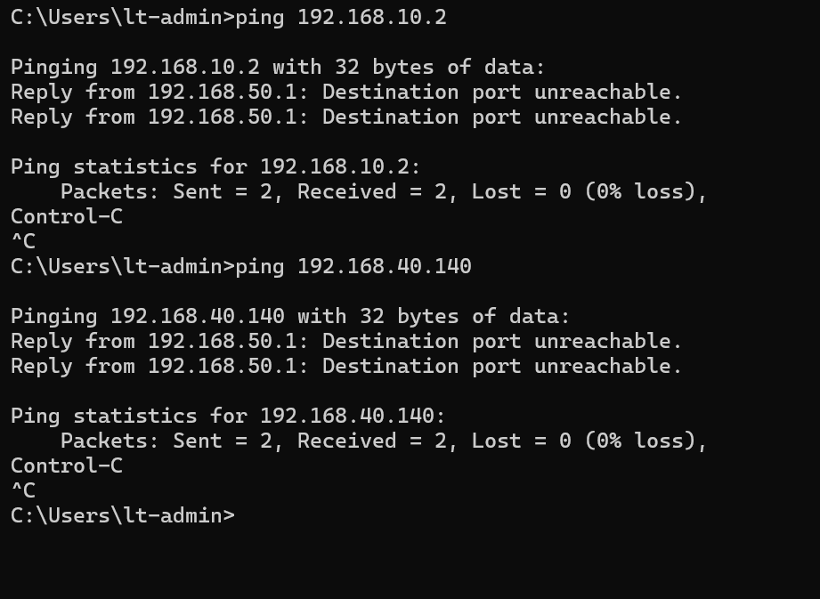

---

# DHCP Architecture

OpenWrt provides independent DHCP services for each VLAN.

| VLAN | DHCP Network | Gateway |
|---|---|---|
| VLAN 10 | 192.168.10.0/24 | 192.168.10.1 |
| VLAN 20 | 192.168.20.0/24 | 192.168.20.1 |
| VLAN 30 | 192.168.30.0/24 | 192.168.30.1 |
| VLAN 40 | 192.168.40.0/24 | 192.168.40.1 |
| VLAN 50 | 192.168.50.0/24 | 192.168.50.1 |

This allows each VLAN to operate as an independent Layer 3 network while using OpenWrt as its default gateway.

---

# Firewall Architecture

OpenWrt firewall zones control communication between network segments.

The high-level policy implemented in the lab is:

| Source VLAN | Internet | Other VLAN Devices |
|---|---|---|
| Management | Allowed | Restricted/administrative |
| Servers | Allowed | Restricted |
| CyberLab | Allowed | Blocked |
| IoT/Test | Allowed | Blocked |
| Forensics | Blocked | Blocked |

The WAN zone performs NAT/masquerading for networks permitted to access the Internet.

Individual internal VLAN zones do not require masquerading.

---

# Understanding OpenWrt Input vs Forwarding

An important concept demonstrated during testing was the difference between firewall **input** and **forwarding**.

## Input

Input controls traffic sent **to the OpenWrt router itself**.

For example:

```text
192.168.20.1
192.168.30.1
192.168.40.1
192.168.50.1
```

These addresses belong to OpenWrt.

A client may therefore be able to ping another VLAN's gateway address even when inter-VLAN forwarding is blocked.

## Forwarding

Forwarding controls traffic passing **through OpenWrt from one network to another**.

For example:

```text
VLAN 30 Client
      |
      v
   OpenWrt
      |
      X
      |
VLAN 20 Client
```

Testing communication against an actual endpoint on another VLAN therefore provides stronger evidence of network isolation than testing only the router's gateway addresses.

---

# Connectivity Validation

The completed lab was tested against several important requirements.

## DHCP

Clients successfully received addresses from the appropriate VLAN DHCP scopes.

## Gateway Connectivity

Clients were able to communicate with the OpenWrt gateway assigned to their VLAN.

## Internet Connectivity

VLANs requiring Internet access successfully reached external IP addresses and resolved DNS names.

## Inter-VLAN Isolation

Cross-VLAN communication was tested against actual endpoints.

Unauthorized forwarding attempts were rejected by OpenWrt.

Examples:

```text
CyberLab -> Server device
BLOCKED

IoT/Test -> Protected internal device
BLOCKED

Forensics -> IoT/Test device
BLOCKED

Forensics -> Internet
BLOCKED
```

---

# Security Design

The architecture follows the principle of **network segmentation**.

Instead of placing all devices into one trusted LAN, systems are separated according to their function and risk level.

```text
Management
    |
    +---- Trusted administration

Servers
    |
    +---- Infrastructure services

CyberLab
    |
    +---- Security testing

IoT/Test
    |
    +---- Less-trusted devices

Forensics
    |
    +---- High-risk / isolated analysis
```

This reduces unnecessary communication between systems and limits the ability of an untrusted or compromised endpoint to communicate directly with protected infrastructure.

---

# Troubleshooting and Lessons Learned

## Tagged vs Untagged VLANs

The OpenWrt-to-GS308E connection must carry multiple VLANs.

IEEE 802.1Q tagging allows several VLANs to share the same physical trunk connection.

Endpoint access ports remain untagged so connected devices do not need to understand VLAN tagging.

---

## Trunk vs Access Ports

A trunk port carries traffic for multiple VLANs.

In this lab:

```text
OpenWrt
   |
   |  VLAN 10
   |  VLAN 20
   |  VLAN 30
   |  VLAN 40
   |  VLAN 50
   |
GS308E Port 1
```

Access ports are assigned to individual VLANs for endpoint devices.

---

## PVID Configuration

Access ports require the appropriate Port VLAN ID (PVID).

```text
Port 2 -> PVID 10
Port 3 -> PVID 20
Port 4 -> PVID 30
Port 5 -> PVID 30
Port 6 -> PVID 30
Port 7 -> PVID 40
Port 8 -> PVID 50
```

Incorrect PVID or VLAN membership can result in clients receiving addresses from the wrong network or losing connectivity.

---

## Router Addresses vs Endpoints

Pinging another VLAN's gateway does not necessarily prove that inter-VLAN forwarding is allowed.

For example:

```text
192.168.20.1
```

belongs to OpenWrt itself.

A firewall may permit traffic to the router while still blocking traffic forwarded to an endpoint such as:

```text
192.168.20.182
```

Testing an actual endpoint on another VLAN therefore provides a more accurate validation of firewall forwarding rules.

---

## ICMP Rejection Messages

During blocked connectivity tests, OpenWrt returned messages such as:

```text
Destination port unreachable
```

This indicates that OpenWrt actively rejected the forwarding attempt.

On Windows, these rejection responses may appear in ping statistics as received packets because the workstation received an ICMP error response from the router.

This does **not** mean the intended destination was reachable.

---

# Skills Demonstrated

This project demonstrates practical experience with:

- OpenWrt administration
- Network segmentation
- VLAN architecture
- IEEE 802.1Q
- Managed switching
- Tagged VLANs
- Untagged VLANs
- Trunk ports
- Access ports
- PVID configuration
- IPv4 subnetting
- DHCP
- DNS
- Routing
- NAT
- Firewall zones
- Inter-VLAN traffic control
- Network isolation
- Network troubleshooting
- Connectivity validation
- Cybersecurity lab architecture
- Digital-forensics network design
- Technical documentation

---

# Future Improvements

Potential future enhancements include:

- Implement explicit firewall allow rules between selected VLANs
- Further restrict router-management access from untrusted VLANs
- Add centralized logging and monitoring
- Integrate Wazuh monitoring
- Integrate a SIEM platform
- Add IDS/IPS monitoring
- Deploy additional server VMs
- Implement DNS filtering
- Add network traffic analysis
- Create an isolated malware-analysis VM environment
- Capture and document firewall logs for blocked inter-VLAN traffic
- Add a graphical network topology diagram
- Test additional attack and defense scenarios within the isolated CyberLab

---

# Project Status

**Core network implementation: Complete**

- [x] OpenWrt router deployment
- [x] Managed switch configuration
- [x] VLAN 10 Management
- [x] VLAN 20 Servers
- [x] VLAN 30 CyberLab
- [x] VLAN 40 IoT/Test
- [x] VLAN 50 Forensics
- [x] IEEE 802.1Q trunk configuration
- [x] Access-port configuration
- [x] PVID configuration
- [x] DHCP configuration
- [x] Firewall zone configuration
- [x] Internet connectivity testing
- [x] Inter-VLAN isolation testing
- [x] Forensic network isolation testing
- [x] GitHub screenshot documentation
- [x] Technical README documentation

---

# Summary

This project demonstrates the design and implementation of a multi-VLAN cybersecurity homelab using **OpenWrt** and a **NETGEAR GS308E managed switch**.

The final architecture separates management systems, servers, cybersecurity testing systems, IoT/test devices, and forensic systems according to their function and risk level.

OpenWrt provides Layer 3 routing, DHCP, DNS forwarding, Internet connectivity, NAT, and firewall enforcement, while the managed switch provides Layer 2 VLAN segmentation and 802.1Q trunking.

The project provided practical experience designing, configuring, troubleshooting, and validating a segmented network rather than simply deploying individual cybersecurity tools.

The completed environment now provides a foundation for continued hands-on work with networking, cybersecurity monitoring, vulnerability testing, digital forensics, incident response, virtualization, and security tooling.
