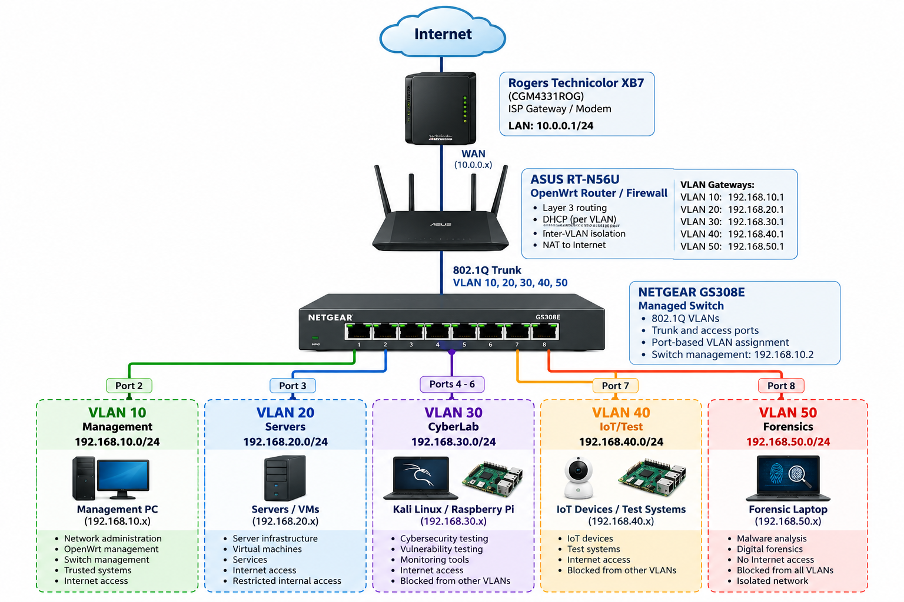

# OpenWrt VLAN Security Homelab

## Overview

This project documents the design, implementation, security configuration, and validation of a segmented networking and cybersecurity homelab built using **OpenWrt** and a **NETGEAR GS308E managed switch**.

The environment was designed to provide hands-on experience with enterprise networking and cybersecurity concepts including:

- VLAN segmentation
- IEEE 802.1Q VLAN tagging
- Trunk and access ports
- IPv4 subnetting
- DHCP
- Routing
- Firewall policies
- Inter-VLAN isolation
- Network troubleshooting
- Cybersecurity testing
- Digital forensics network isolation

The network separates management systems, servers, cybersecurity testing systems, IoT/test devices, and forensic systems into dedicated security zones.

---

## Lab Objectives

The primary objectives of this project were to:

- Deploy OpenWrt as the lab router and firewall
- Configure a managed switch for VLAN segmentation
- Implement IEEE 802.1Q VLAN tagging
- Configure trunk and access ports
- Create independent IPv4 networks for each VLAN
- Configure dedicated DHCP scopes
- Implement OpenWrt firewall zones
- Restrict unauthorized inter-VLAN communication
- Provide Internet access only where required
- Create a dedicated cybersecurity testing network
- Create an isolated forensic/malware-analysis network
- Validate segmentation through connectivity testing
- Document the implementation as a cybersecurity portfolio project

---

# Network Topology

The following diagram illustrates the physical and logical architecture of the homelab, including the OpenWrt router/firewall, managed switch, VLAN segmentation, port assignments, and network roles.



The high-level traffic path is:

```text
Internet
   |
   v
Rogers XB7 Gateway
10.0.0.1/24
   |
   | WAN
   v
ASUS RT-N56U
OpenWrt Router / Firewall
   |
   | 802.1Q Trunk
   | VLAN 10, 20, 30, 40, 50
   v
NETGEAR GS308E
Managed Switch
   |
   +-- Port 2 ------ VLAN 10 ------ Management
   |
   +-- Port 3 ------ VLAN 20 ------ Servers
   |
   +-- Ports 4-6 --- VLAN 30 ------ CyberLab
   |
   +-- Port 7 ------ VLAN 40 ------ IoT/Test
   |
   +-- Port 8 ------ VLAN 50 ------ Forensics
```

---

# Hardware and Software

| Component | Purpose |
|---|---|
| ASUS RT-N56U | OpenWrt router/firewall |
| OpenWrt 25.12.1 | Routing, DHCP, VLAN and firewall services |
| NETGEAR GS308E | Managed Layer 2 switch |
| Rogers XB7 Gateway | Upstream Internet gateway |
| Raspberry Pi 4 | Linux and cybersecurity testing |
| Windows Systems | Management and lab endpoints |
| Forensic Laptop | Isolated forensic/malware-analysis system |
| VMware ESXi | Virtualized lab infrastructure |

---

# VLAN Architecture

Five VLANs were created to separate systems according to their purpose and security requirements.

| VLAN | Name | Network | Gateway | Purpose |
|---|---|---|---|---|
| 10 | Management | 192.168.10.0/24 | 192.168.10.1 | Network administration |
| 20 | Servers | 192.168.20.0/24 | 192.168.20.1 | Server infrastructure |
| 30 | CyberLab | 192.168.30.0/24 | 192.168.30.1 | Cybersecurity testing |
| 40 | IoT/Test | 192.168.40.0/24 | 192.168.40.1 | IoT and test systems |
| 50 | Forensics | 192.168.50.0/24 | 192.168.50.1 | Forensics and malware analysis |

Each VLAN operates as an independent Layer 3 network.

OpenWrt acts as the default gateway and provides DHCP and firewall enforcement for each network.

---

# NETGEAR GS308E Configuration

The NETGEAR GS308E provides Layer 2 VLAN segmentation.

The connection between the switch and OpenWrt operates as an **802.1Q trunk**, allowing multiple VLANs to travel across a single physical Ethernet connection.

## Switch Port Assignment

| Port | VLAN | Mode | Purpose |
|---|---|---|---|
| Port 1 | VLAN 1, 10, 20, 30, 40, 50 | Trunk/Hybrid | OpenWrt uplink |
| Port 2 | VLAN 10 | Access | Management |
| Port 3 | VLAN 20 | Access | Servers |
| Port 4 | VLAN 30 | Access | CyberLab |
| Port 5 | VLAN 30 | Access | CyberLab |
| Port 6 | VLAN 30 | Access | CyberLab |
| Port 7 | VLAN 40 | Access | IoT/Test |
| Port 8 | VLAN 50 | Access | Forensics |

Port 1 carries VLANs 10, 20, 30, 40, and 50 as tagged traffic.

Access ports present traffic as untagged Ethernet to connected endpoints.

---

# PVID Configuration

Each access port is assigned the PVID corresponding to its VLAN.

| Port | PVID |
|---|---:|
| Port 1 | 1 |
| Port 2 | 10 |
| Port 3 | 20 |
| Port 4 | 30 |
| Port 5 | 30 |
| Port 6 | 30 |
| Port 7 | 40 |
| Port 8 | 50 |

Correct PVID configuration ensures that untagged traffic entering an access port is assigned to the correct VLAN.

---

# VLAN 10 — Management

**Network:** `192.168.10.0/24`  
**Gateway:** `192.168.10.1`

VLAN 10 is the trusted management network.

It is used for administrative access to network infrastructure such as:

- OpenWrt
- NETGEAR GS308E
- Network management systems
- Administrative workstations

The management IP address of the GS308E was moved to:

```text
192.168.10.2
```

A management workstation successfully received a VLAN 10 DHCP address and was able to reach the gateway, switch management interface, DNS services, and the Internet.

## VLAN 10 Evidence

### Connectivity Test


### NETGEAR Management VLAN


### OpenWrt Management Interface


---

# VLAN 20 — Servers

**Network:** `192.168.20.0/24`  
**Gateway:** `192.168.20.1`

VLAN 20 provides a dedicated network for server infrastructure.

Separating servers from user and security-testing networks provides additional control over communication with infrastructure services.

OpenWrt provides:

- Layer 3 gateway
- DHCP
- DNS forwarding
- Firewall enforcement
- Internet forwarding

Port 3 of the GS308E is configured as the VLAN 20 access port.

## VLAN 20 Evidence

### OpenWrt Servers Firewall Zone


### GS308E Server VLAN


### Connectivity and Isolation Test


---

# VLAN 30 — CyberLab

**Network:** `192.168.30.0/24`  
**Gateway:** `192.168.30.1`

VLAN 30 provides a dedicated environment for cybersecurity experimentation and testing.

Potential systems and workloads include:

- Kali Linux
- Raspberry Pi security projects
- Vulnerability testing systems
- Monitoring tools
- Security virtual machines
- Network analysis tools

Internet access is permitted while forwarding to protected internal VLAN endpoints is restricted.

During testing, a Raspberry Pi successfully received a VLAN 30 DHCP address.

Connectivity was verified to:

```text
192.168.30.1
8.8.8.8
google.com
```

Attempts to communicate with protected endpoints on other VLANs were blocked.

## VLAN 30 Evidence

### OpenWrt VLAN Configuration


### CyberLab Firewall Zone


### Connectivity and Isolation Test


---

# VLAN 40 — IoT/Test

**Network:** `192.168.40.0/24`  
**Gateway:** `192.168.40.1`

VLAN 40 provides a separate network for IoT devices and other test systems.

These devices can access required Internet resources while remaining separated from protected internal endpoints.

The GS308E uses Port 7 as the VLAN 40 access port.

A Raspberry Pi was used to validate the network.

Testing confirmed connectivity to:

```text
192.168.40.1
8.8.8.8
google.com
```

Attempts to reach protected devices on other VLANs were blocked.

## VLAN 40 Evidence

### OpenWrt IoT/Test Firewall Zone


### GS308E VLAN Port Assignment


### Connectivity and Isolation Test


---

# VLAN 50 — Forensics / Malware Analysis

**Network:** `192.168.50.0/24`  
**Gateway:** `192.168.50.1`

VLAN 50 is the most restricted network in the lab.

It was designed for:

- Digital forensics
- Malware analysis
- Suspicious file analysis
- Isolated virtual machines
- Security experimentation

Unlike the other lab VLANs, VLAN 50 does not have forwarding permission to the WAN or other internal networks.

```text
VLAN 50 -> Internet       BLOCKED
VLAN 50 -> Management     BLOCKED
VLAN 50 -> Servers        BLOCKED
VLAN 50 -> CyberLab       BLOCKED
VLAN 50 -> IoT/Test       BLOCKED
```

The GS308E uses Port 8 as the VLAN 50 access port.

---

## VLAN 50 Validation

A Windows forensic/test laptop successfully received:

```text
IP Address:     192.168.50.182
Subnet Mask:    255.255.255.0
Gateway:        192.168.50.1
DNS:            192.168.50.1
DHCP Server:    192.168.50.1
```

Local gateway connectivity succeeded:

```text
ping 192.168.50.1

SUCCESS
```

Internet forwarding was blocked:

```text
ping 8.8.8.8

Destination port unreachable
```

Cross-VLAN communication was tested against a Raspberry Pi located on VLAN 40:

```text
ping 192.168.40.140

Destination port unreachable
```

This confirmed that OpenWrt prevented the forensic network from forwarding traffic to another VLAN endpoint.

## VLAN 50 Evidence

### DHCP and Network Configuration


### Internet Isolation Test


### Inter-VLAN Isolation Test


---

# DHCP Architecture

OpenWrt provides independent DHCP services for each VLAN.

| VLAN | DHCP Network | Gateway |
|---|---|---|
| VLAN 10 | 192.168.10.0/24 | 192.168.10.1 |
| VLAN 20 | 192.168.20.0/24 | 192.168.20.1 |
| VLAN 30 | 192.168.30.0/24 | 192.168.30.1 |
| VLAN 40 | 192.168.40.0/24 | 192.168.40.1 |
| VLAN 50 | 192.168.50.0/24 | 192.168.50.1 |

Each VLAN therefore operates as an independent broadcast domain with its own IPv4 subnet and DHCP scope.

---

# Firewall Architecture

OpenWrt firewall zones control traffic between the VLANs and the Internet.

The high-level security policy is:

| Source Network | Internet | Other VLAN Endpoints |
|---|---|---|
| Management | Allowed | Restricted / Administrative |
| Servers | Allowed | Restricted |
| CyberLab | Allowed | Blocked |
| IoT/Test | Allowed | Blocked |
| Forensics | Blocked | Blocked |

The WAN zone performs NAT/masquerading for VLANs permitted to access the Internet.

The internal VLAN firewall zones themselves do not require masquerading.

---

# Understanding Input vs Forwarding

One important networking concept demonstrated during the project was the difference between **firewall input** and **firewall forwarding**.

## Input

Input controls traffic addressed directly to the OpenWrt router.

For example:

```text
192.168.10.1
192.168.20.1
192.168.30.1
192.168.40.1
192.168.50.1
```

These addresses belong to OpenWrt itself.

Because of this, a device may be able to ping another VLAN's gateway even when forwarding between those VLANs is blocked.

## Forwarding

Forwarding controls traffic that must travel **through OpenWrt** from one network to another.

Example:

```text
CyberLab Client
192.168.30.x
       |
       v
    OpenWrt
       |
       X  BLOCKED
       |
Server Endpoint
192.168.20.x
```

Testing against an actual endpoint on another VLAN therefore provides stronger evidence of segmentation than testing only the router's gateway interfaces.

---

# Connectivity Validation

The completed environment was tested against several requirements.

## DHCP

Clients successfully received addresses from their assigned VLAN DHCP scopes.

## Gateway Connectivity

Clients successfully communicated with the OpenWrt gateway assigned to their network.

## DNS

Networks permitted to access the Internet successfully resolved domain names.

Example:

```text
google.com
```

## Internet Connectivity

Networks with WAN forwarding successfully reached external resources.

Example:

```text
ping 8.8.8.8
```

## Inter-VLAN Isolation

Cross-VLAN communication was tested against actual endpoints.

Examples:

```text
CyberLab -> Server endpoint
BLOCKED

IoT/Test -> Protected endpoint
BLOCKED

Forensics -> IoT/Test endpoint
BLOCKED

Forensics -> Internet
BLOCKED
```

---

# Security Design

The architecture follows the principle of **network segmentation**.

Instead of placing every system into a single trusted LAN, devices are separated according to their purpose and risk level.

```text
Management
    |
    +---- Trusted administration

Servers
    |
    +---- Infrastructure services

CyberLab
    |
    +---- Security testing

IoT/Test
    |
    +---- Less-trusted devices

Forensics
    |
    +---- High-risk / isolated analysis
```

Segmentation reduces unnecessary communication between systems and limits the ability of a compromised or untrusted endpoint to communicate directly with protected infrastructure.

---

# Troubleshooting and Lessons Learned

## Tagged vs Untagged VLANs

The OpenWrt-to-GS308E connection needs to carry multiple VLANs.

IEEE 802.1Q tagging allows multiple logical networks to share the same physical Ethernet connection.

Endpoint access ports remain untagged so connected devices do not need to support VLAN tagging.

---

## Trunk vs Access Ports

The connection between OpenWrt and the GS308E functions as the trunk.

```text
OpenWrt
   |
   | VLAN 10
   | VLAN 20
   | VLAN 30
   | VLAN 40
   | VLAN 50
   |
GS308E Port 1
```

The remaining switch ports operate as access ports for their assigned networks.

---

## PVID Configuration

Correct PVID configuration is essential on access ports.

For example:

```text
Port 2 -> PVID 10
Port 3 -> PVID 20
Port 4 -> PVID 30
Port 5 -> PVID 30
Port 6 -> PVID 30
Port 7 -> PVID 40
Port 8 -> PVID 50
```

An incorrect PVID or VLAN membership configuration can cause devices to receive addresses from the wrong network or lose network connectivity entirely.

---

## Router Addresses vs Endpoints

Pinging another VLAN's OpenWrt gateway does not necessarily mean that inter-VLAN forwarding is permitted.

For example:

```text
192.168.20.1
```

is an address belonging to OpenWrt.

An actual server might instead use:

```text
192.168.20.182
```

Testing the endpoint provides a more accurate validation of the forwarding policy.

---

## ICMP Rejection Messages

During blocked tests, OpenWrt returned responses such as:

```text
Destination port unreachable
```

This demonstrates that the router rejected the forwarding attempt.

Windows may count the ICMP rejection as a received packet because the workstation received an error message from the router.

This does not mean the intended destination responded.

---

# Skills Demonstrated

This project demonstrates hands-on experience with:

- OpenWrt administration
- Managed switching
- Network segmentation
- VLAN architecture
- IEEE 802.1Q
- Tagged VLANs
- Untagged VLANs
- Trunk ports
- Access ports
- PVID configuration
- IPv4 subnetting
- DHCP
- DNS
- Routing
- NAT
- Firewall zones
- Inter-VLAN traffic control
- Network isolation
- Connectivity testing
- Network troubleshooting
- Cybersecurity lab architecture
- Digital-forensics network design
- Technical documentation

---

# Future Improvements

The homelab provides a foundation for additional networking and cybersecurity projects.

Potential future improvements include:

- Harden management access to OpenWrt
- Implement explicit firewall allow rules where required
- Add centralized logging
- Integrate Wazuh monitoring
- Integrate a SIEM platform
- Add IDS/IPS monitoring
- Deploy additional server VMs
- Implement DNS filtering
- Add network traffic analysis
- Capture firewall logs for blocked traffic
- Create additional attack-and-defense scenarios
- Build an isolated malware-analysis VM environment
- Implement monitoring between security zones
- Expand the server VLAN with additional infrastructure services

---

# Project Status

**Core Network Implementation: Complete**

- [x] OpenWrt router deployment
- [x] Managed switch configuration
- [x] VLAN 10 Management
- [x] VLAN 20 Servers
- [x] VLAN 30 CyberLab
- [x] VLAN 40 IoT/Test
- [x] VLAN 50 Forensics
- [x] IEEE 802.1Q trunk configuration
- [x] Access-port configuration
- [x] PVID configuration
- [x] DHCP configuration
- [x] Firewall zone configuration
- [x] Internet connectivity testing
- [x] Inter-VLAN isolation testing
- [x] Forensic network isolation testing
- [x] Screenshot documentation
- [x] Network topology diagram
- [x] GitHub technical documentation

---

# Summary

This project demonstrates the design, implementation, troubleshooting, and validation of a segmented cybersecurity homelab using **OpenWrt** and a **NETGEAR GS308E managed switch**.

Five VLANs were implemented to separate management systems, servers, cybersecurity testing systems, IoT/test devices, and forensic systems.

OpenWrt provides Layer 3 routing, DHCP, DNS forwarding, NAT, Internet connectivity, and firewall enforcement, while the NETGEAR GS308E provides Layer 2 VLAN segmentation and IEEE 802.1Q trunking.

Connectivity and isolation testing verified that the VLANs operate according to their intended security policies, including complete Internet and inter-VLAN isolation for the forensic network.

The completed environment provides a reusable platform for continued hands-on work with networking, cybersecurity monitoring, vulnerability testing, digital forensics, incident response, virtualization, and security tooling.
